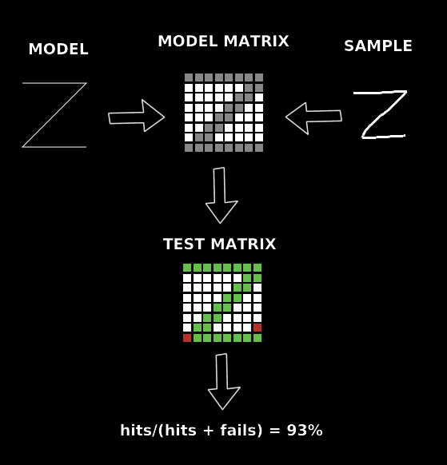

# Phaser shape recognition
This class provides some utilities for shape and stroke recognition using [Phaser 3](http://phaser.io/).  
Can be used to process image data and feed neural networks.
Try demo here: https://jjcapellan.github.io/demo-phaser-shape-recognition/

<p align="center">

</p>

## Table of contents
* [Installation](#Installation)
 * [Browser](#Browser)
 * [From NPM](#From-NPM)
 * [Usage](#Usage) 
 * [Methods](#Methods)
 * [makeMatrix()](#makeMatrix)
 * [test()](#test)
 * [License](#License)

## Installation
### Browser
There are two alternatives:
* Point a script tag to the CDN link:
```
<script src="https://cdn.jsdelivr.net/gh/jjcapellan/phaser-shape-recognition/dist/phaser-shape-recognition.umd.js">
``` 
* Download the file [phaser-shape-recognition.umd.js](https://cdn.jsdelivr.net/gh/jjcapellan/phaser-shape-recognition/dist/phaser-shape-recognition.umd.js) to your proyect folder and add a reference in your html:
```
<script src="localPath/phaser-shape-recognition.umd.js">
``` 
Then you can access the class by the global **ShapeRec**:
```
// In your create function ...
const shapeRec = new ShapeRec(this); 
```

### From NPM
```
npm install phaser-shape-recognition
```
Then you can acces the class as:
* CommenJS module
```
const ShapeRec = require('phaser-shape-recognition');

// In your create function ...
const shapeRec = new ShapeRec(this); 
```

* ES6 module
```
import ShapeRec from 'phaser-shape-recognition';

// In your create function ...
const shapeRec = new ShapeRec(this); 
```

## Usage
Example (Image vs Points comparison):
```
// In create function ...
const shapeRec = new ShapeRec(this);

// Makes an array of 10x10 of booleans from the image.
const imageMatrix = shapeRec.makeMatrix('textureKey', 'textureFrame', 10);

// Hardcoded array of points
const points =[{x: 2, y: 4}, {x: 4, y: 14}, { ... } ...];

// Makes an array of 10x10 of booleans from the points array
const pointsMatrix = shapeRec.makeMatrix(points, null, 10)

// Test the similitude between the image and the shape represented in the points array
// shapeRec.test() returns a number between 0 and 1. 1 means the two shapes are identical and 0 the opposite.
let similitude = shapeRec.test(imageMatrix, pointsMatrix);
```
**Important**:
* About images: makeMatrix() only use the alpha values, so the image should have transparent background.
* test() only can compare matrix of the same size. Ex: you can't compare 10x10 vs 12x12. 

## Methods
### makeMatrix(source, frame, resolution)
Transforms an array of raw points or an image into a "normalized" array of booleans (**matrix**)
Params:
* **source** { string | Point[]} Can be the string key of a texture or an array of points (Ex: [{x: 2, y:2}, {x:3, y:5}, ...])
* **frame** { (string | number) } String or index of the texture frame. Not used if source is an array.
* **[resolution = 10]** { number } Size of the matrix. High values reduce false positives and increase false negatives in shape recognition. With low values the opposite occurs.
Returns:
* { boolean[][] } Matrix of booleans. Each cell of the matrix represents one sector of the image. If in that sector exists some positive alpha then its value will be "true".

### test(matrix1, matrix2)
Compares two matrix of same size: 
* matrix1\[i]\[j] == matrix2\[i]\[j] ---> HIT  
* matrix1\[i]\[j] != matrix2\[i]\[j] ---> FAIL
Params:
* **matrix1** { boolean[][] } Matrix of first shape
* **matrix2** { boolean[][] } Matrix of second shape
Returns:
* { number } Number between 0 and 1: hits / (hits + fails)

## License
This code is released under [MIT LICENSE](https://raw.githubusercontent.com/jjcapellan/phaser-shape-recognition/master/LICENSE).